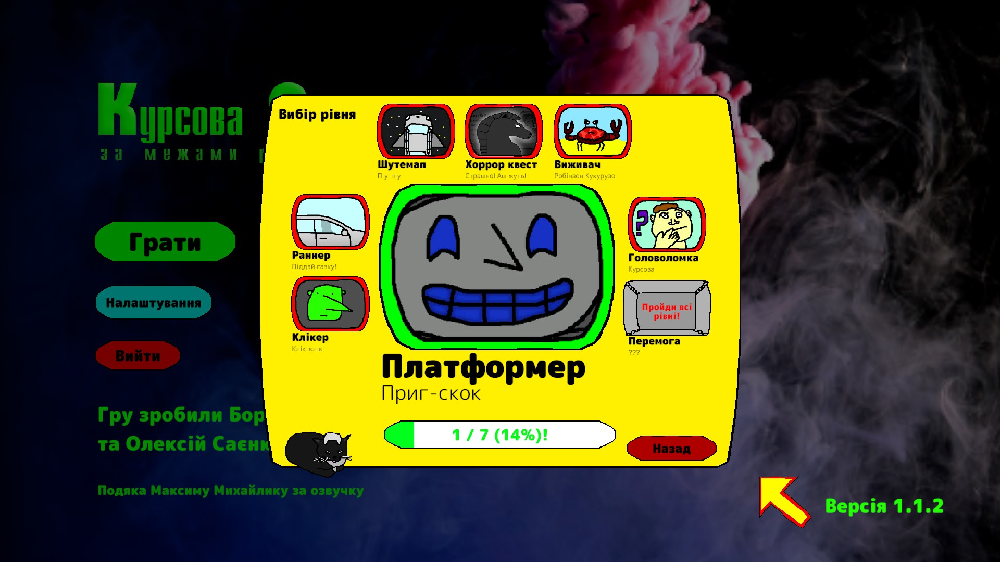

# Курсова робота: за межами реальності

Репозиторій курсового проекту з дисципліни "Сучасні мови об'єктно-орієнтованого програмування" команди групи КН-24-1 "Щалені програмісти".

Останній білд можна завантажити тут https://drive.google.com/file/d/1LUiHAeni51mW-yE868AzKFZqTO7RZoiv/view?usp=sharing

Склад команди:
- Борис Соломка (тімлід)
- Олексій Саєнко

Проект складається із 7 різних ігор:
- Клікер;
- Раннер;
- Шутемап;
- Хоррор квест;
- Виживач;
- Головоломка;
- Платформер.

Вихідний код розташований у теці Assets/Scripts/.
Дизайн-документ: https://docs.google.com/document/d/1XC4C-vvGw8esqU0ubh5JrW8huCUPlw5-wlfDsbKTEM0/edit?tab=t.0
